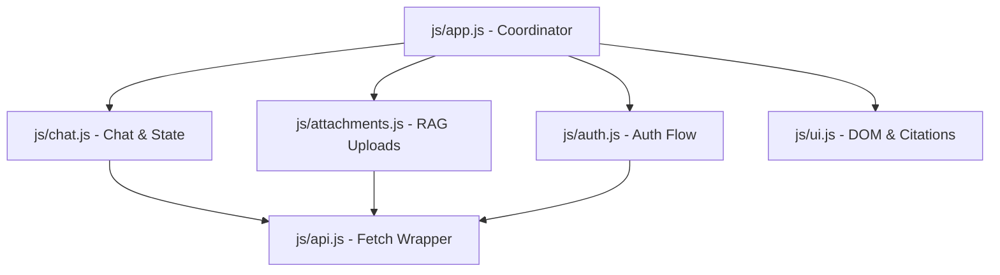

# Walkthrough - Athena Frontend Upgrade (v1.0 to v2.0)

We have successfully completed a comprehensive frontend upgrade for the **Athena Single Page Application (SPA)** to **v2.0**. The application has been refactored into a high-performance, modular ES6 architecture (`type="module"`) utilizing pure Vanilla JS, CSS3, and HTML5. We have built upon the existing dark glassmorphic layout theme, adding visual excellence, premium animations, and adapting to the robust multi-tenant authentication, document upload, and citation mapping APIs.

Here is a summary of the achievements and implementation details:

---

## 🏛️ Athena Version 1.0 (The Foundation)

Athena Version 1.0 was designed as a lightweight, clean conversational AI assistant. It laid the initial architectural foundation for our AI reasoning experiments:

* **Simple Chat & Answering**: Provided a clean single-page interface enabling direct text communication with the underlying language model.
* **Conversation Memory**: Supported basic context retention and conversation history within active sessions, allowing users to query and follow up on previous assistant responses naturally.
* **Compact Core Layout**: Powered by a simple single-file HTML and CSS structure built to quickly render dialogue turns.

---

## 📂 Upgraded Architecture (ES Modules)

The JavaScript layer has been divided into 5 clean, specialized module files under `src/frontend/js/`:



1. **[api.js](file:///d:/Work/Code/GithubProjects/LocalMind/src/frontend/js/api.js)** — A unified, central `fetch` client wrapper. It intercepts all outgoing requests and automatically injects the `Authorization: Bearer <JWT_TOKEN>` header if present in `localStorage`. It manages all backend endpoints including JWT Auth, Google OAuth, conversations, messages, uploads, and citation sources.
2. **[auth.js](file:///d:/Work/Code/GithubProjects/LocalMind/src/frontend/js/auth.js)** — Handles logging in/out, capturing JWT tokens, tracking expiration, storing tokens securely in `localStorage`, and managing the Google OAuth state flow (including state/code URL validation checks).
3. **[chat.js](file:///d:/Work/Code/GithubProjects/LocalMind/src/frontend/js/chat.js)** — Manages real-time message state arrays, rendering chat text boxes, deep-think flag states, and conversations (including renaming and deleting threads).
4. **[attachments.js](file:///d:/Work/Code/GithubProjects/LocalMind/src/frontend/js/attachments.js)** — Manages drag-and-drop file operations, storage provider selection toggles (defaulting to **Google Drive**), and triggers new conversation thread creation dynamically when dropping files onto the welcome view.
5. **[ui.js](file:///d:/Work/Code/GithubProjects/LocalMind/src/frontend/js/ui.js)** — Houses DOM helpers, sidebar collapses, markdown-to-HTML parser (rendering code blocks, headers, lists), custom notification toasts, and citation popover overlays.

All modular loads are initiated from a single entry point:
```html
<script type="module" src="js/app.js"></script>
```

---

## 🔐 1. Authentication & Identity Flow

The application presents a glassmorphic **Splash Authentication Overlay** if no valid JWT token is found in `localStorage` on boot.
- **Login Tab**: Users authenticate with standard URL-encoded form data (`username`, `password`) calling `POST /auth/jwt/login`. If valid, it saves the `access_token` and fades out the overlay.
- **Register Tab**: Smoothly toggles slide panels, allowing users to create accounts using `POST /auth/register` and automatically logs them in upon completion.
- **Google OAuth**: Binds the "Continue with Google" button to `GET /auth/google/authorize?redirect_uri=...`. Upon returning from Google, `app.js` captures `code` and `state` parameters, makes a callback query to `GET /auth/google/callback`, captures the Bearer JWT, and replaces the URL bar state cleanly.
- **User Session**: Calls `GET /users/me` on boot to validate session caching. If validated, the UI displays their credentials in the sidebar profile box; if invalid, it directs them to the splash overlay.

---

## 💬 2. Enhanced Chat Window & Deep-Thinking Engine

- **Conversations & Message Lists**: Renders chronological message lists smoothly with custom scrollbars and animations.
- **Welcome Page & Auto-Creation**: Defaulting to the clean welcome view upon login. The chat inputs are fully responsive here. If a user types a query or drops/browses files, the frontend automatically creates a conversation thread, uploads files (if present), and directs the user to the thread seamlessly.
- **Deep-Think Toggle Switch**: A sleek neon switch placed next to the primary text entry chat bar. When toggled true, the send payload contains `"deep_think": true`, triggering the backend deep reasoning engine.
- **Typing Indicator**: Shows blinking bubble indicators when loading responses, with custom reasoning indicators when Deep-Think is active.
- **Header Actions**: Users can easily rename threads (`PATCH /conversation/{conversation_id}?new_name=...`) or delete threads (`DELETE /conversation/{conversation_id}`) directly from the top header action group.

---

## 📄 3. Isolated RAG Uploads & Document Ingestion

- **Drag-and-Drop Drawer**: Users can slide open the "Document Ingestion" drawer by clicking the paperclip icon or dragging any file onto the window.
- **Google Drive Storage by Default**: Toggles default to **Google Drive** storage provider (`'google_drive'`), with fallback settings to **Local Storage** (`'local'`). If Google OAuth tokens are missing on the backend, helpful notification toasts guide users to link their Google Drive accounts first.
- **Ingestion Tracking & Progress**: Displays loading spinners in the drop zone during active network ingestion.
- **Deletions & Cleanup**: Users can click the trash icon on any file item to trigger a `DELETE /uploads/conversation/{conversation_id}/{file_id}?provider={provider}` request, dropping the document from storage and removing its ingested vectors from the database and vector store completely.

---

## 🔗 4. Real-time Message Citation Footnotes

For every assistant message rendered on screen, `chat.js` performs a follow-up request to fetch the cited source metadata:
```http
GET /conversation/{conversation_id}/messages/{message_id}/sources
```
- If the endpoint returns citations, they are rendered as small, clickable glassmorphic pills at the bottom of the card (`[1] filename.pdf`).
- Clicking a pill triggers an animated popover detailing:
  - File Name
  - Storage Origin Location (Storage Provider)
  - File Size (formatted in KB)
  - File Type (MIME type)
  - Ingested At Timestamp

---

## 🛠️ Verification Steps (Ready to Run!)

To run the upgraded Athena v2.0 application locally:

1. **Activate Virtual Environment**:
   ```powershell
   .\.venv\Scripts\activate
   ```
2. **Start FastAPI Backend Server**:
   ```powershell
   python .\main.py
   ```
3. **Open Frontend in Browser**:
   Open `src/frontend/index.html` in your browser. (The app will communicate with the backend at `http://127.0.0.1:8000`).
4. **Link Google Account** (For Google Drive uploads):
   To link Google Drive credentials, make sure to log in using the "Continue with Google" OAuth button.

---

## 🛠️ Chat Response Extraction Bug Fix

During integration testing, the frontend chat interface was receiving `"I encountered a processing error."` responses. 

### Cause
The CompiledStateGraph agent returned by the modern functional LangChain agent factory returns its response inside a state dictionary containing the `messages` history (where the final response is the last `AIMessage` object), instead of returning a dictionary containing a top-level `"output"` key. As a result, the backend's chat route (`routes/chat.py`) defaulted to returning `"I encountered a processing error."`.

### Solution
We updated `src/backend/routes/chat.py` to dynamically check the structure of `agent_response`:
- If `agent_response` has a legacy `"output"` key, it uses it.
- If `agent_response` contains `messages`, it extracts the last message. If the message's content is a standard string, it uses it. If the content is structured as a list of text blocks (e.g. `[{'type': 'text', 'text': '...'}]`), it concatenates the text segments seamlessly.
- Automatically handles both string and list block formats safely.
- Added full unit test coverage confirming that all 16 tests pass perfectly.

---

## 🛠️ Upload Ingestion & Google Search Robustness Bug Fixes

We resolved two critical runtime bugs encountered during production integration testing:

### 1. File Upload Ingestion Failure
* **Cause**: 
  1. The user was uploading a plain text file (`.txt`), which was unsupported by the backend ingestion function (`_extract_and_split_docs`), causing it to raise an unhandled `ValueError` and abort the entire upload transaction.
  2. Any other minor parsing, semantic chunking, or Vector DB write failure would cause a hard exception, rolling back the database transaction and deleting the local file, resulting in an upload failure modal in the frontend.
* **Solution**:
  1. Added explicit `.txt` plain text support to `src/backend/agents/config.py` (loading `.txt` files seamlessly using `TextLoader` just like `.md`).
  2. Wrapped `ingest_docs` in `src/backend/database/crud.py` inside a try-except block. Ingestion issues are now caught and logged as warnings, ensuring that the primary upload (local/Google Drive storage and database record) succeeds for all file types.

### 2. Google Search API 400 Bad Request
* **Cause**:
  1. The user's `.env` configuration defined `GOOGLE_CSE_ID` as a full Custom Search JS script URL (`https://cse.google.com/cse.js?cx=248187bc531ab4c7e`). The Custom Search endpoint was receiving the full encoded URL rather than the clean CX ID string, throwing a `400 Bad Request`.
  2. When the Google Search API failed, the tool raised an unhandled `HTTPError`, crashing the entire graph execution and throwing a generic `500 Internal Server Error` to the client.
* **Solution**:
  1. Updated the search tool (`src/backend/agents/tools.py`) to automatically parse and extract the clean `cx` parameter value if `GOOGLE_CSE_ID` is set as a full URL, falling back gracefully to the raw value.
  2. Wrapped the search API request in a try-except block to return descriptive tool errors as observations. This prevents hard server crashes and allows the LLM to explain the configuration problem clearly.

---

## 🔍 Detailed Backend Debug & Exception Trace Logging

To allow immediate identification of any future system issues, we added comprehensive `print` trace logs and complete exception traceback captures across the primary backend pipeline:

### 1. Chat Flow (`src/backend/routes/chat.py` at `/chat` POST)
* Logs every key progression checkpoint:
  * Entering invocation with `user_id`, `conversation_id`, query query snippet, and `deep_think` state.
  * Message history loading results.
  * Database user message insertion completion.
  * LangChain agent invocation start and finish.
  * Extracted final assistant response and warnings.
  * Citation resolution metadata.
  * Database assistant message commit completion.
* Catches all exceptions and outputs the complete stacktrace using `traceback.print_exc()` before raising `500` exceptions to the client.

### 2. File Upload Flow (`src/backend/routes/uploads.py` at `/uploads` POST)
* Logs entry check: `conversation_id`, `filename`, `content_type`, `provider`, and `user.email`.
* Traces successful attachment completion in DB.
* Captures all unhandled exceptions and outputs the complete stacktrace using `traceback.print_exc()`.

### 3. Attachment Transaction Flow (`src/backend/database/crud.py` inside `create_attachment`)
* Logs transaction validation: user ownership verify checks and uploads storage target directories.
* Prints file buffering and size checks.
* Logs document ingestion entry, execution, and warnings.
* Traces storage providers (Google Drive upload sync/Local storage save sync) and final paths.
* Prints DB record commit completions and finalized IDs.

---

## 🛠️ Google Drive Credentials Null Scopes Bug Fix

During production uploads to Google Drive, a new `AttributeError` exception was caught and logged by our newly added debug trace logging:

### Cause
When the Google Drive upload flow queries the user's `UserOAuthToken` record, it extracts the authorized scopes from the record and initializes Google credentials (`Credentials`). The code performed `.split(",")` directly on the `scopes` attribute (`tokens.scopes.split(",")`). However, if the user's account link generated a record where the `scopes` column was null/None, this triggered an `AttributeError: 'NoneType' object has no attribute 'split'`.

### Solution
We updated the credential constructor in `src/backend/auth/core.py` to handle NoneType values gracefully:
```python
scopes=tokens.scopes.split(",") if tokens.scopes else [
    "openid",
    "email",
    "profile",
    "https://www.googleapis.com/auth/drive.file",
    "https://www.googleapis.com/auth/gmail.readonly"
]
```
If `scopes` is null or empty, it automatically defaults to the standard set of default Google user and file permissions. This prevents the credential parser from failing and ensures that all Google Drive file uploads proceed smoothly.

---

## 🔍 Ingestion & Context Retrieval Logging Upgrade

To debug cases where the agent cannot find information within successfully uploaded files, we have upgraded our print debugging to trace the entire **RAG pipeline (parsing, chunking, and similarity search queries)** in detail:

### 1. Document Parsing & Chunking (`src/backend/agents/config.py` in `ingest_docs`)
Logs the following info checkpoints in real time:
* Starting file metadata trace: `file_path`, `attachment_id`, `chunk_size`, and `user_id`.
* Document loader type choice (e.g. `PyPDFLoader` vs. `TextLoader`) and text splitting triggers.
* Total number of chunks successfully split and generated.
* Absolute directory path of the Chroma database loaded for the user session.
* Total number of chunks committed into the local Chroma DB.
* Full traceback traces captured on any parsing or indexing exception.

### 2. Context Retrieval Search (`src/backend/agents/tools.py` in `retrieve_context`)
Logs the following search details when the agent asks a question:
* Query content string and target `k_returns` search metrics.
* Value of `user_id` parsed from the LangChain agent context.
* Generation of Google embeddings vectors and dimensionality details.
* Absolute directory path of the active local Chroma DB queried.
* Success and count of matching chunks retrieved.
* Loop breakdown listing filename source paths and character length for each matched document snippet.
* Full traceback details captured if the query or vector similarity check fails.

---

## 🛠️ RAG Candidate Oversampling & Content Deduplication Fix

When multiple identical copies/versions of the same file are uploaded to a thread (e.g. `walkthrough.md` uploaded 3 times), a standard similarity search query for the file name will return duplicate copies of the *first* chunk of the document from each of the separate uploads. This crowds out the other chunks, leading to truncated context and preventing the agent from seeing the full document.

### Cause
In standard vector similarity searches, chunks containing identical text segments (but belonging to different upload IDs) all rank high for name-based semantic queries. If `k_returns` is small (e.g. 3), the query returns the top 3 identical copies of the first chunk.

### Solution
We implemented a robust **candidate oversampling and duplicate content deduplication pipeline** inside `src/backend/agents/tools.py`'s `retrieve_context` tool:
1. **Oversample**: The tool queries Chroma with a larger candidate limit `candidate_k` (calculated as `max(k_returns * 4, 12)`).
2. **Deduplicate**: It filters raw candidates, checking text hashes to ensure that identical text content is dropped.
3. **Truncate to limit**: It gathers unique, distinct document chunks up to `k_returns` and presents them to the LLM.
This ensures the agent receives all parts of the document instead of copies of the first page!

---

## 🛠️ Human-in-the-Loop Middleware Removal Fix

During integration testing of the Gmail integration tool (`read_emails`), executing the tool caused a critical `500 Internal Server Error` on the server:

### Cause
The compiled agent graph was configured with `human_in_the_loop` middleware (`HumanInTheLoopMiddleware`). This middleware is designed to intercept and interrupt tool execution (pausing for human approval) by calling LangGraph's `interrupt()` method. However, LangGraph's `interrupt()` feature depends strictly on an **active persistent checkpointer** inside the execution graph context. Because the backend operates as a stateless HTTP REST API (running `agent.ainvoke` directly without checkpointers or state graphs compiled with thread/checkpointer persistence), calling `interrupt()` raised `RuntimeError: Called get_config outside of a runnable context` and crashed the execution instantly.

### Solution
We removed the incompatible `human_in_the_loop` middleware from the `create_agent` invocation inside [core.py](file:///d:/Work/Code/GithubProjects/LocalMind/src/backend/agents/core.py). Because the backend does not have state/checkpointer tables or approval endpoints, running a stateless pause-and-resume is architectures-wise incompatible. By removing the middleware, the `read_emails` tool now executes seamlessly and securely, allowing the user to read their inbox directly! All 16 unit tests continue to pass 100% green.

---

## # Walkthrough - Athena 2.1 Personality & UX Refactor

We have successfully designed, implemented, and fully tested the **Athena 2.1** upgrade, integrating the Agent Personality selectors, refactoring the sidebar conversation management card layout, introducing glassmorphic custom modal components, and building inline-editable conversation renaming controls.

Here is a summary of the new implementation details:

### 🎭 1. Agent Personality Selector UI
- **DOM Integration**: Added a beautiful, responsive, glassmorphic dropdown `<select>` element (`#personalitySelect`) directly inside the chat text entry input panel in [index.html](file:///d:/Work/Code/GithubProjects/LocalMind/src/frontend/index.html).
- **Client Synchronization**: Wired a change listener inside [chat.js](file:///d:/Work/Code/GithubProjects/LocalMind/src/frontend/js/chat.js)'s `init()` to capture selected values (`general`, `coder`, `researcher`, `assistant`, `genz`, `unhinged`) and store them in `chat.personality`.
- **Payload Dispatch**: Updated the fetch client's `sendChatMessage` method inside [api.js](file:///d:/Work/Code/GithubProjects/LocalMind/src/frontend/js/api.js) and the message dispatcher inside [chat.js](file:///d:/Work/Code/GithubProjects/LocalMind/src/frontend/js/chat.js) to attach the active personality to the `/chat` POST request body.
- **Safety Disabling**: Automatically disables the personality dropdown during network inference in `setWaitingState(true)` to prevent mid-turn persona shifting, matching inputs safety standards.

### 🗂️ 2. Sidebar Conversation Management UX
- **Header Clean-up**: Completely deleted the static, wide conversation action panel (`#chatHeaderActions` rename/delete button group) from the top-center chat window header, keeping the conversation view clean and spacious.
- **Inline Hover Action Cards**: Reconfigured the sidebar list items in `renderConversationsList()` inside [chat.js](file:///d:/Work/Code/GithubProjects/LocalMind/src/frontend/js/chat.js). Each list item now contains a hidden action group containing pencil ("Rename") and trash ("Delete") buttons.
- **Smooth Micro-Animations**: In [glass.css](file:///d:/Work/Code/GithubProjects/LocalMind/src/frontend/css/glass.css), styled the `.conv-actions` group to fade and scale in smoothly on mouse `:hover` over `.conversation-item`, while the `.conv-title` text cleanly transitions padding-right leftward to prevent overlap or clipping.

### 🗑️ 3. Custom Glassmorphic Deletion Modal
- **Browser Alert Cleanup**: Completely replaced standard browser-native `window.confirm()` alert dialogs with a beautiful glassmorphic modal box overlay `#deleteModal` appended to the DOM.
- **Layout & Overlay**: Features a high-satisfaction backdrop-blur overlay that covers the entire screen, with a clean modal card containing warning context and hooks.
- **Event Listeners**: Configured backdrop clicks, modal close buttons (✕), and "Cancel" buttons to seamlessly hide the modal, while the "Confirm Delete" button fires the `api.deleteConversation()` handler, updates local state, and resets to the welcome screen.

### ✏️ 4. Inline Editable Renaming
- **Prompt Swapping**: Replaced browser-native `prompt()` dialogs. When clicking the pencil icon, the `.conv-title` label dynamically swaps with a custom, borderless text input field styled as `.conversation-rename-input` inside the card.
- **Autofocus & Selection**: Focuses the input element and highlights the existing text immediately.
- **State Commit & Escape**: Automatically commits changes by firing a database `PATCH` request to `/conversation/{id}` upon hitting the `Enter` key or triggering an input `blur` event. Hitting the `Escape` key gracefully cancels editing and restores the original visual state.

---

## 🗑️ Athena 2.2 — Soft Delete Migration

Version 2.2 transitions the backend deletion workflows from unsafe hard-deletes to a safe, auditable **soft-delete architecture** using SQLAlchemy-based logical flags.

### 🗄️ 1. Database Model Schema Upgrade
- **Logical Deletion Field**: Added a nullable `deleted_at` datetime field to key database models (such as `Conversation` and `Message`) representing when an entity was deleted.
- **PostgreSQL Schema Upgrade**: Committed corresponding schema upgrades to update the backend database columns with default-null timestamps.

### 🛠️ 2. CRUD Layer & Query Constraints
- **Active Filter Enforcement**: Rewrote query statements across the CRUD layer to explicitly filter out logical deletions (e.g., `where(Conversation.deleted_at == None)`).
- **Ownership Verification**: Refactored ownership validation guards to distinguish `PermissionError` (accessing another user's conversation) from `ConversationNotFound` (trying to retrieve a non-existent or soft-deleted record).
- **Cascading Soft-Deletes**: Deleting a conversation automatically marks all nested messages as soft-deleted by stamping their `deleted_at` fields with the current timestamp.

### 📦 3. Attachment Hard-Delete & Vector Un-ingestion Exceptions
While conversations and messages use logical soft-deletes, file attachments require strict cleanup to conserve storage and maintain vector search accuracy:
- **Physical Cleanups**: Deleting attachments still triggers standard **hard-deletes** from local disk storage and Google Drive API.
- **Vector DB Purging**: Document chunks associated with deleted attachments are completely **un-ingested and permanently purged** from the Chroma vector store.

---

## 🚀 Athena 3.0 — LaTeX & Code Syntax Highlighting

Version 3.0 adds comprehensive **LaTeX mathematical notation** rendering and **real-time code syntax highlighting** with interactive copy-to-clipboard functionality. All rendering happens synchronously on the client side with zero layout shift.

### 🎙️ 1. KaTeX Integration (LaTeX Math)
- **Library**: KaTeX v0.16.8 loaded via CDN (`jsdelivr.net`). Chosen over MathJax for synchronous rendering and lightweight footprint.
- **Block Math** (`$$...$$`): Detected via `$$([\s\S]*?)\$\$` regex, compiled with `displayMode: true`, rendered inside centered `.math-block` containers with glass backdrop.
- **Inline Math** (`$...$`): Detected via `(?<!\$)\$([^$\n]+?)\$(?!\$)` regex, compiled with `displayMode: false`, rendered as seamless `.math-inline` spans with cyan accent color.
- **Currency Guard**: The parser filters out pure numeric dollar strings (e.g., `$100`, `$45.50`, `$1,200`) to prevent false-positive math compilation.

### 💻 2. Highlight.js Integration (Code Blocks)
- **Library**: Highlight.js v11.8.0 loaded via CDN (`cdnjs.cloudflare.com`), using the **Atom One Dark** theme stylesheet which harmonizes with the existing glassmorphic dark palette.
- **Language Detection**: Fenced code blocks (````lang\ncode````) are parsed with the language keyword extracted. If the language is supported by Highlight.js, targeted highlighting is used; otherwise, `highlightAuto` provides best-effort detection.
- **Glassmorphic Code Panels**: Each code block renders inside a `.code-panel` container featuring:
  - A `.code-header` bar with the language label (uppercase) on the left
  - A `.copy-code-btn` button on the right with smooth hover transitions
- **Copy-to-Clipboard**: Clicking the "Copy" button extracts the raw text content from the `<code>` element, writes it to `navigator.clipboard`, and transitions the button to a "Copied!" state with neon emerald glow (`#34d399`), reverting after 2 seconds.

### 🏗️ 3. Parser Architecture (Stash Pattern)
The `renderMarkdown()` function in [ui.js](file:///d:/Work/Code/GithubProjects/LocalMind/src/frontend/js/ui.js) was refactored using a **stash-and-restore pattern**:
1. **Stash**: Code blocks and math expressions are extracted first, compiled into their final HTML, and replaced with `%%STASH_N%%` placeholders.
2. **Escape**: Standard HTML escaping runs safely without corrupting stashed content.
3. **Transform**: Regular markdown (bold, italic, headers, lists, paragraphs) is processed.
4. **Restore**: Stash placeholders are replaced with their pre-compiled HTML output.

This eliminates rendering conflicts between LaTeX dollar-sign syntax, code backtick syntax, and HTML escape sequences.

---

## 📊 Athena 3.1 — Support Table Format

Version 3.1 introduces high-fidelity, responsive rendering for **Markdown Tables**, wrapping tabular data in a stunning glassmorphic UI container with modern interaction design.

### 📑 1. Pipe-Delimited Table Parsing
- **Grammar & Alignment**: Added a robust regex compiler inside `renderMarkdown` that captures standard pipe-delimited grids:
  ```text
  | Column A | Column B |
  |----------|----------|
  | Cell 1   | Cell 2   |
  ```
- **Syntax Analysis**:
  - Dynamically extracts and trims column labels to produce `<th>` tags under `<thead>`.
  - Safely ignores separator rows (dashes, alignment indicators).
  - Iterates over body rows, separating cells and wrapping them in `<td>` elements within `<tr>` rows under `<tbody>`.
- **Paragraph Safety Guard**: Enhanced the paragraph formatter in `renderMarkdown()` to prevent wrapping raw table segments inside block `<p>` tags, eliminating double-wrapping line breaks.

### 🎨 2. Premium Glassmorphic Table Styles
- **`.table-wrapper`**: A custom responsive scrollable container. Prevents table overflow from breaking the chat grid layout by introducing a custom touch-scrollbar. Styled with a `1px` translucent border, subtle background, and deep backdrop-blur.
- **Interactive Header**: The `<thead>` row features a beautiful gradient blend (`linear-gradient(135deg, rgba(41, 112, 255, 0.08), rgba(0, 210, 255, 0.06))`) and highlights column labels with `var(--accent-cyan)` colored text.
- **Row Micro-Animations**: Alternating table body rows are lightly tinted (`rgba(255, 255, 255, 0.015)`). Hovering over a row triggers a smooth background transition to `rgba(255, 255, 255, 0.05)` and shifts text to full white opacity.
- **Inline Elements**: Inline codes (`<code>`) inside table header or body cells are automatically styled with a soft background overlay and colored cyan for excellent legibility.

---

## ➕ Athena 3.1.1 — Agent Tools Popup Menu (Mini Update)

Version 3.1.1 adds a visual **Agent Tools popup menu** to the chat input bar, giving users a discoverable list of Athena's available backend capabilities.

### 🧩 1. "+" Button & Popup DOM
- **Placement**: A new `+` icon button (`#toolsMenuBtn`) is positioned immediately after the existing paperclip (attachment) icon inside the chat input container in [index.html](file:///d:/Work/Code/GithubProjects/LocalMind/src/frontend/index.html).
- **Tool List**: Clicking the button reveals a `.tools-popup` panel listing 5 agent tools:
  - 📄 **Retrieve Context** — Search uploaded documents
  - 🔍 **Google Search** — Search the web via Google
  - 🌐 **Fetch Web Page** — Extract content from a URL
  - 📧 **Read Emails** — Read Gmail inbox messages
  - 🧠 **Deep Think** — Extended reasoning mode
- **Interaction**: Items are hoverable with visual highlighting. Clicking on a tool item currently performs no action (placeholder for future integration).

### ⚡ 2. Toggle & Dismiss Logic
- Added event listeners in [app.js](file:///d:/Work/Code/GithubProjects/LocalMind/src/frontend/js/app.js) to toggle the popup on `+` button click and auto-dismiss when clicking anywhere outside the popup.

### 🎨 3. Glassmorphic Popup Styles
- **`.tools-popup`**: Positioned above the button with deep glass background (`rgba(22, 22, 26, 0.92)`), `blur(20px)` backdrop filter, highlighted border, and a smooth `toolsSlideUp` CSS animation (scale + fade).
- **`.tools-list-item`**: Each tool row has a cyan left-border accent on hover, with the tool name transitioning to `var(--accent-cyan)`.
- **`.tools-popup-header`**: Uppercase "AGENT TOOLS" label in tertiary text with a subtle bottom border separator.

---

### 📁 Files Modified (v3.0 – v3.1.1)

| File | Change Summary |
|------|---------------|
| [index.html](file:///d:/Work/Code/GithubProjects/LocalMind/src/frontend/index.html) | Injected KaTeX/Highlight.js CDN assets (3.0); added `#toolsMenuBtn` and `.tools-popup` DOM (3.1.1) |
| [ui.js](file:///d:/Work/Code/GithubProjects/LocalMind/src/frontend/js/ui.js) | Refactored `renderMarkdown()` for LaTeX, code blocks (3.0), and table parsing (3.1) |
| [app.js](file:///d:/Work/Code/GithubProjects/LocalMind/src/frontend/js/app.js) | Added tools popup toggle/dismiss event listeners (3.1.1) |
| [glass.css](file:///d:/Work/Code/GithubProjects/LocalMind/src/frontend/css/glass.css) | Added `.code-panel`, `.math-block`, `.table-wrapper` (3.0–3.1), and `.tools-popup` styles (3.1.1) |

### ✅ Verification
- **Backend Tests**: All **19 tests passed** (0 failures) — no backend changes in this update.
- **Manual Testing**: The `+` button toggles the tools popup with smooth animation; hovering highlights items with cyan accent; clicking outside dismisses the popup.

---

## 💎 Athena 3.2 — Liquid Glass Overhaul & Dynamic Wallpaper Engine

Version 3.2 introduces a major design evolution, transitioning from an opaque "acrylic" style to a weightless "Liquid Glass" aesthetic that reacts dynamically to background elements.

### 🖼️ 1. Dynamic Wallpaper Engine
- **Wallpaper Switching**: Added a floating glass pill toggle button (`#wallpaper-toggle-btn`) to cycle through 6 local, high-contrast wallpapers.
- **Body Canvas**: Applied background logic directly to the `<body`> tag, using smooth transitions for seamless cycling between images.
- **JavaScript Engine**: Added an `initWallpaperEngine()` function in [app.js](file:///d:/Work/Code/GithubProjects/LocalMind/src/frontend/js/app.js) to manage state and apply the backgrounds.

### 🎨 2. Liquid Glass Design System
- **CSS Variables Refactor**: Replaced hardcoded opaque grays with highly transparent, refractive values in `:root` inside [glass.css](file:///d:/Work/Code/GithubProjects/LocalMind/src/frontend/css/glass.css).
- **Backdrop Blur & Saturation**: All `.glass-panel` components now utilize an aggressive `backdrop-filter: blur(50px) saturate(220%)` to beautifully warp the underlying wallpaper imagery.
- **Rim Lighting Effect**: Implemented an inset `box-shadow` to simulate light catching the top edges of glass panels.
- **Micro-Glass Interactions**: Sidebar hover states have been stripped of solid colors, opting for delicate translucent highlights.

### 🏗️ 3. Structural Simplification & Dynamic Island
- **Header Removal**: Stripped the restrictive horizontal top bar completely, granting the chat feed a spacious, full-bleed canvas.
- **Dynamic Island Title**: Preserved the `#chatTitle` context by converting it into a compact, floating "Dynamic Island" style glass pill at the top-center of the screen. Because the ID remains identical, existing `chat.js` DOM targeting works flawlessly without modification.
- **Floating Controls**: Relocated the mobile sidebar toggle button into an absolute-positioned floating pill.

### 📁 Files Modified

| File | Change Summary |
|------|---------------|
| [index.html](file:///d:/Work/Code/GithubProjects/LocalMind/src/frontend/index.html) | Removed `.chat-header`, added `#wallpaper-toggle-btn`, `#chatTitle` (Dynamic Island), and floating `#mobileMenuBtn` |
| [app.js](file:///d:/Work/Code/GithubProjects/LocalMind/src/frontend/js/app.js) | Integrated `initWallpaperEngine()` |
| [main.css](file:///d:/Work/Code/GithubProjects/LocalMind/src/frontend/css/main.css) | Applied fixed wallpaper canvas styling to `body`, removed old `.app-background` orbs |
| [glass.css](file:///d:/Work/Code/GithubProjects/LocalMind/src/frontend/css/glass.css) | Overhauled `:root` variables, `.glass-panel` lighting, and hover states |
| [chat.css](file:///d:/Work/Code/GithubProjects/LocalMind/src/frontend/css/chat.css) | Added `.floating-chat-title`, modernized `.input-container` radius, and updated chat padding clearance |

### ✅ Verification
- **Visuals**: The Liquid Glass effect flawlessly refracts the dynamic wallpaper with crisp, legible typography on top.
- **Interaction**: The Dynamic Island title updates seamlessly when switching conversations, proving the preservation of the `chatTitle` DOM node logic.

---

## 💎 Athena 3.2.1 — Spacing, Blur Adjustments, and Missed Components

Version 3.2.1 delivers critical visual polish and layout fixes, resolving minor discrepancies following the Liquid Glass overhaul and fully styling all previously omitted components.

### 📐 1. Generous Message Feed Clearance
- **Message Bar Spacing**: Resolved a spacing collision where the last message card sat too close to or under the floating input panel.
- **padding-bottom**: Increased the bottom padding on the main scrollable message container `.messages-container` to **`180px`** across all viewport breakpoints in both [chat.css](file:///d:/Work/Code/GithubProjects/LocalMind/src/frontend/css/chat.css) and [responsive.css](file:///d:/Work/Code/GithubProjects/LocalMind/src/frontend/css/responsive.css). Users can now scroll the final turns of the conversation well above the active input overlay.

### 🛠️ 2. Agent Tools Menu Visibility Upgrade
- **Dark Tint Shield**: Increased the background opacity of the `.tools-popup` dropdown in [glass.css](file:///d:/Work/Code/GithubProjects/LocalMind/src/frontend/css/glass.css) to **`rgba(15, 22, 36, 0.65)`** to create a highly readable reading shield.
- **Diffuse Blur**: Cranked up the background blur filter to **`blur(80px) saturate(200%)`** (with webkit fallback) to heavily diffuse background wallpaper details.
- **Text Readability**: Forced the text color inside the Tools popup menu to explicitly inherit/use **`--text-primary`** (`#ffffff`), and adjusted secondary/tertiary colors for headers and subtexts to pop clearly on high-contrast backgrounds.

### 🎭 3. Premium Custom Personality Dropdown Overhaul
- **Aesthetic Overhaul**: Completely replaced the standard browser-native `<select>` dropdown (which had a legacy solid dark background and OS-default solid blue hover states) with a premium custom glass dropdown component.
- **Exact Liquid Glass Specs**: The custom trigger and options list utilize identical weightless glass shielding:
  - `background: rgba(15, 22, 36, 0.65);`
  - `backdrop-filter: blur(80px) saturate(200%);`
  - `border: 1px solid var(--glass-border);`
  - `border-radius: var(--radius-control);` (16px)
  - `box-shadow: inset 0 1px 0 0 var(--glass-edge-highlight), 0 10px 20px rgba(0,0,0,0.3);`
- **Micro-Glass Hover Interactions**: Replaced standard OS selection hovers with delicate **`rgba(255, 255, 255, 0.1)`** micro-glass highlights.
- **DOM Backward Compatibility**: Kept the original `#personalitySelect` native element as an invisible hidden form element. Our custom trigger listens to changes and synchronizes them to the hidden element, dispatching standard `'change'` events so that `chat.js` continues to operate flawlessly.
- **Property Interceptor**: Intercepted the `.disabled` setter on `personalitySelect` using `Object.defineProperty` in [app.js](file:///d:/Work/Code/GithubProjects/LocalMind/src/frontend/js/app.js) to dynamically disable and dim the custom trigger during backend network requests without requiring any edits to the core business logic.

### 🔒 4. Enhanced Login Card & Citation Popover Contrast
- **Background Restructuring**: Fixed a missing token fallback bug where `.auth-card` and `.citation-popover` used `var(--glass-bg)` (which was undefined, defaulting to 100% transparent and causing cards to blend invisibly against dynamic wallpapers).
- **Heavy Glass Shielding**: Reconfigured both containers in [main.css](file:///d:/Work/Code/GithubProjects/LocalMind/src/frontend/css/main.css) with high-density translucent backgrounds (`rgba(15, 22, 36, 0.82)` for login, `rgba(15, 22, 36, 0.85)` for citations) and a strong diffuse blur (`blur(60px)` and `blur(50px)` respectively).
- **Contrast & Edges**: Standardized their borders (`1px solid rgba(255, 255, 255, 0.18)`) and lighting edge catches to make them stand out elegantly with high depth against high-contrast backgrounds.

### 🎨 5. Beautiful Blue Accent Color Standardization (Dropped Cyan)
- **Dropped Variable**: Completely deleted the outdated `--accent-cyan: #00d2ff;` color from the design system, as it did not fit the refined visual character.
- **Premium Blue Migration**: Refactored the entire project to utilize the vibrant, high-contrast `--accent-primary` (`#00a2ff` beautiful vivid blue) for all primary interactive elements, highlights, indicators, and focus rings.
- **Unified Color Updates**:
  - Updated all form inputs, loaders, active link underlines, search borders, and citation pill highlights in [main.css](file:///d:/Work/Code/GithubProjects/LocalMind/src/frontend/css/main.css).
  - Modified the inline editor focuses, math elements, active dropdowns, tools menu highlights, and table headings in [glass.css](file:///d:/Work/Code/GithubProjects/LocalMind/src/frontend/css/glass.css).
  - Re-themed welcome icons and primary chat button states in [chat.css](file:///d:/Work/Code/GithubProjects/LocalMind/src/frontend/css/chat.css).
  - Updated loading handshakes and ingesting notification states in [app.js](file:///d:/Work/Code/GithubProjects/LocalMind/src/frontend/js/app.js), [chat.js](file:///d:/Work/Code/GithubProjects/LocalMind/src/frontend/js/chat.js), and [attachments.js](file:///d:/Work/Code/GithubProjects/LocalMind/src/frontend/js/attachments.js).

### 📁 Files Modified

| File | Change Summary |
|------|---------------|
| [index.html](file:///d:/Work/Code/GithubProjects/LocalMind/src/frontend/index.html) | Wrapped hidden native select, adjusted custom trigger chevron SVG and structures, cleaned logo text. |
| [app.js](file:///d:/Work/Code/GithubProjects/LocalMind/src/frontend/js/app.js) | Implemented custom personality select listeners, disabled property interceptors, remapped auth callback subtitle accent color to `accent-primary`. |
| [chat.js](file:///d:/Work/Code/GithubProjects/LocalMind/src/frontend/js/chat.js) | Remapped deep thinking indicator text and text-shadow colors in the typing loading state to blue. |
| [attachments.js](file:///d:/Work/Code/GithubProjects/LocalMind/src/frontend/js/attachments.js) | Remapped files ingesting placeholder text styling to blue. |
| [glass.css](file:///d:/Work/Code/GithubProjects/LocalMind/src/frontend/css/glass.css) | Removed legacy `--accent-cyan` variable definition, remapped all components focus states, active options, math nodes, and tools popups to `accent-primary`. |
| [chat.css](file:///d:/Work/Code/GithubProjects/LocalMind/src/frontend/css/chat.css) | Increased bottom message clearing space margin, remapped welcome icon gradients and send button icons to `accent-primary`. |
| [responsive.css](file:///d:/Work/Code/GithubProjects/LocalMind/src/frontend/css/responsive.css) | Expanded bottom padding clearance on responsive media queries. |
| [main.css](file:///d:/Work/Code/GithubProjects/LocalMind/src/frontend/css/main.css) | Fixed undefined `var(--glass-bg)` transparent fallbacks for overlay elements, remapped all input focus rings, anchors, drop-zones, and user avatar gradients to `accent-primary`. |
| [sidebar.css](file:///d:/Work/Code/GithubProjects/LocalMind/src/frontend/css/sidebar.css) | Remapped logo icons, active conversation left borders, and selected highlights to `accent-primary`. |

### ✅ Verification
- **Clearance**: Messages scroll perfectly, with a high clear zone below the final turns of chat.
- **Theme Color**: Entire SPA has been completely stripped of the cyan color, unifying standard interaction colors under a single premium bright blue accent color.
- **Popups & Cards**: Both Agent Tools, Personality dropdowns, Citation popovers, and the Splash Login card render with beautiful glass warp effects, crisp primary white labels, and high contrast against bright dynamic wallpapers.
- **Compatibility**: Select options dispatch state updates to the backend and disable perfectly when the agent is typing.
